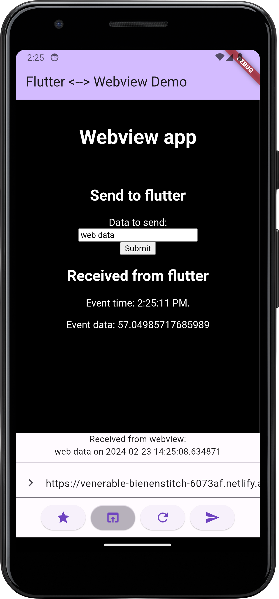

# Flutter <--> webview data exchange

Proof of concept for data exchange between Flutter and web app inside webview.



## Flutter app

### Web app to Flutter communication

In web app:

The web app can send data to the Flutter app using the `window.flutter_inappwebview.callHandler()` method.
```javascript
function sendMessageToFlutter(message) {
    window.flutter_inappwebview.callHandler('flutterApp', message).then(function(result) {
       console.log(result);
    });
}
```

In flutter app:

Flutter listens for messages from the web app using the `WebViewController.addJavaScriptHandler()` method.

```dart
InAppWebView(
  ...
  onWebViewCreated: (controller) {
    webViewController.addJavaScriptHandler(handlerName: 'flutterApp', callback: (data) {
      _recieveData(args[0]);
    });
  },
  ...
),
```

### Flutter to web app communication

The Flutter app is a simple app with a button that sends a message to the web app.

It uses the `flutter_inappwebview` package to display the web app.

In flutter app:

Flutter can send data to the web app using the `WebViewController.evaluateJavascript()` method.

```dart
void _sendData(String data) async {
  await webViewController?.evaluateJavascript(source: "receiveMessageFromFlutter('$data');");
}
```

In web app:

it calls the `receiveMessageFromFlutter` function in the web app with the data as an argument.

```javascript
function receiveMessageFromFlutter(message) {
    currentTime = new Date().toLocaleTimeString();
    document.getElementById("response").innerHTML = `<p>Event time: ${currentTime}.</p><p>Event data: ${message}</p>`;
}
```

## Web app

Example app hosted at https://elgreen.github.io/flutter-webview-poc/

It's a simple web app that displays the time and a message. The message is set by the Flutter app.

Web app source code in docs folder.

[index.html](docs%2Findex.html)